# Patrones Mermaid para Clases de Programación

## Flujos de Datos y Procesos

### Patrón: Flujo de Request-Response
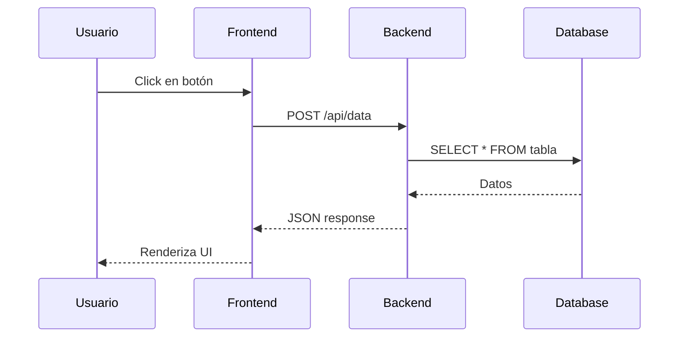

### Patrón: Arquitectura de Aplicación Web
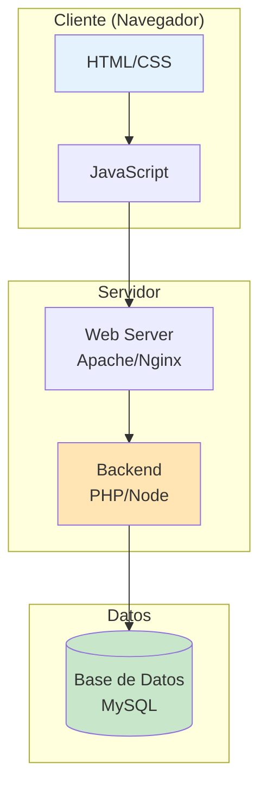

### Patrón: Ciclo de Vida de Request HTTP
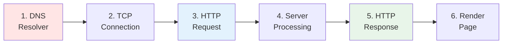

### Patrón: Comparación de Metodologías
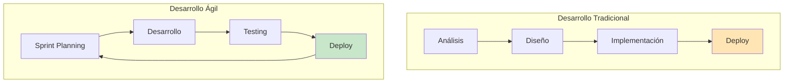

## Estados y Transiciones

### Patrón: Estados de un Formulario
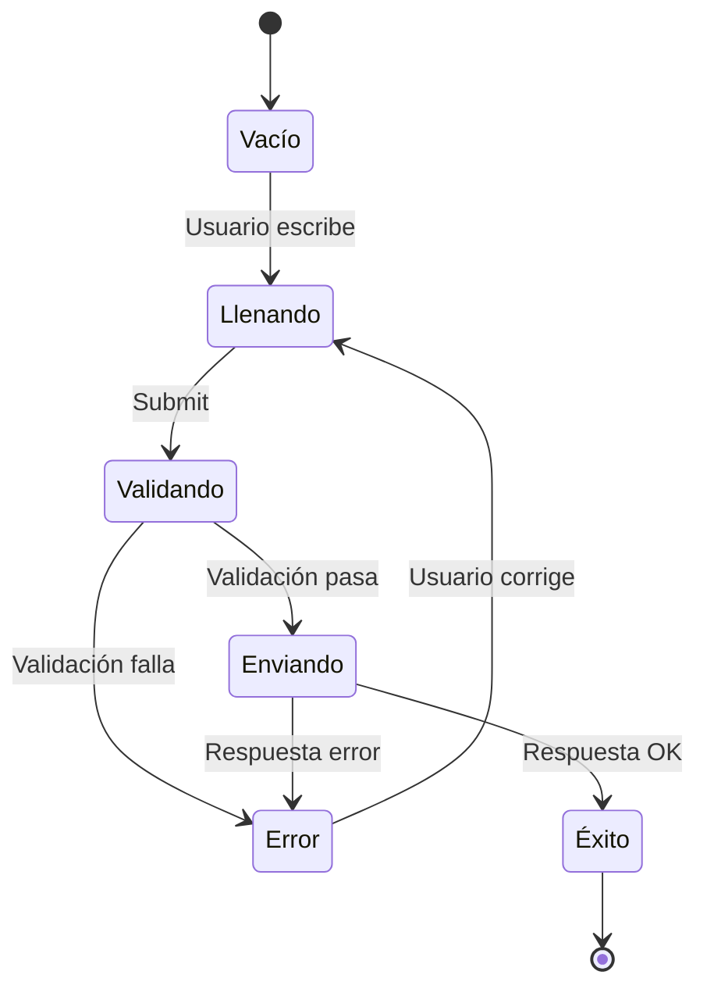

### Patrón: Ciclo de Vida de Componente React
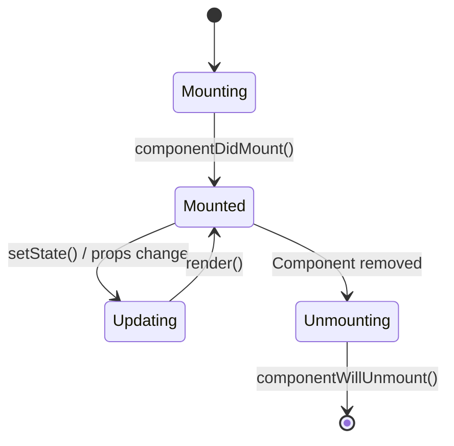

## Timeline y Evolución

### Patrón: Historia de una Tecnología
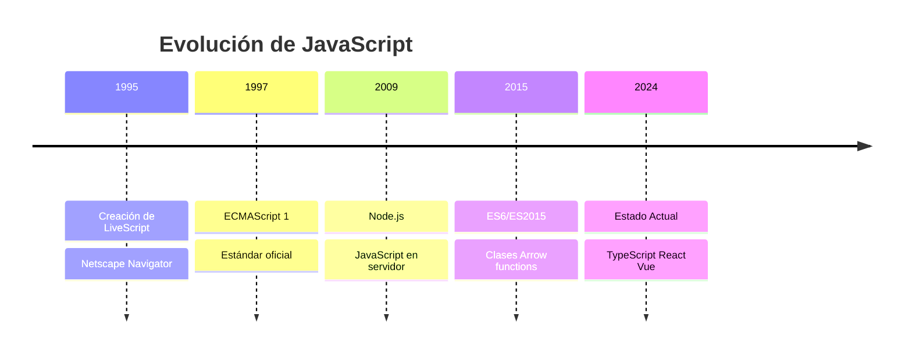

### Patrón: Roadmap de Curso
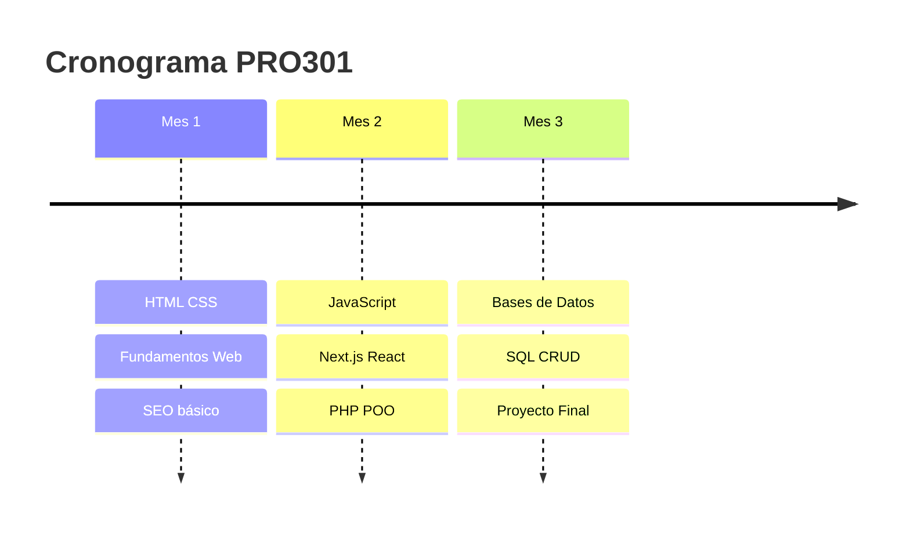

## Mindmaps Conceptuales

### Patrón: Desglose de Tecnología
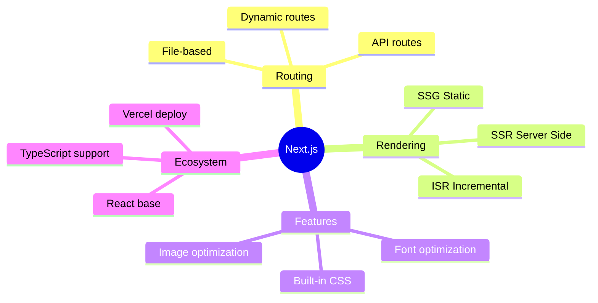

### Patrón: Comparación de Conceptos
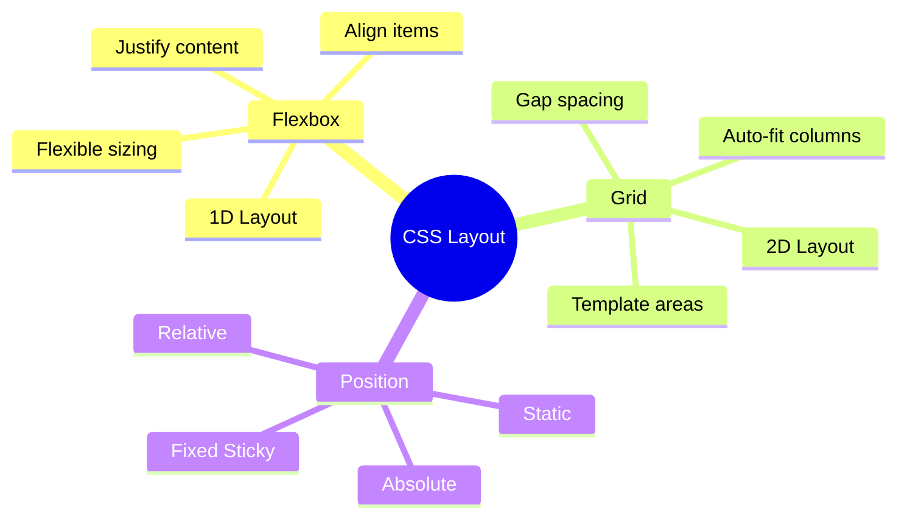

## Diagramas de Relaciones (ERD)

### Patrón: Modelo de Datos Básico
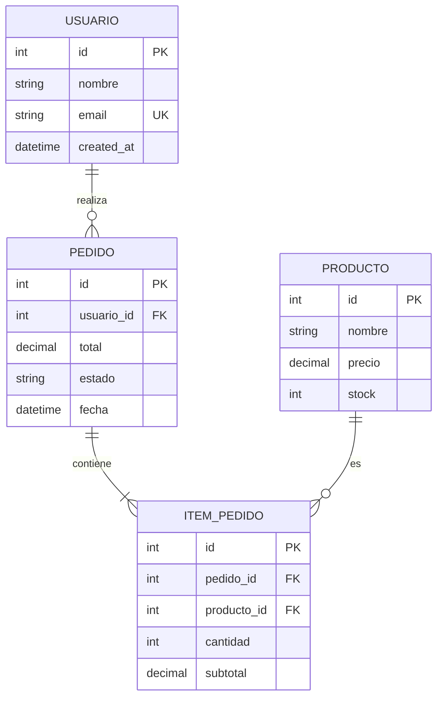

### Patrón: Relaciones de Autenticación
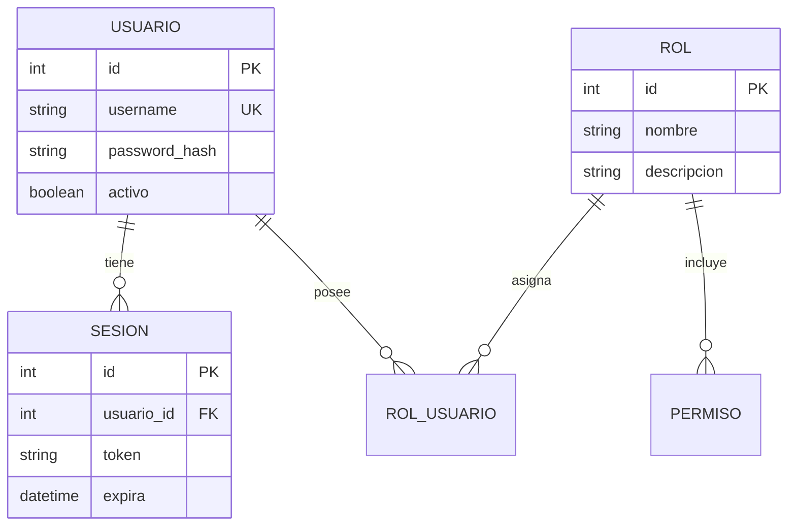

## Diagramas de Clases (OOP)

### Patrón: Jerarquía de Clases
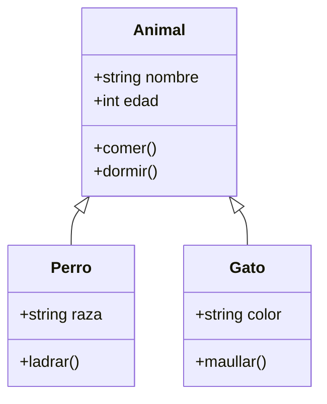

### Patrón: MVC (Modelo-Vista-Controlador)
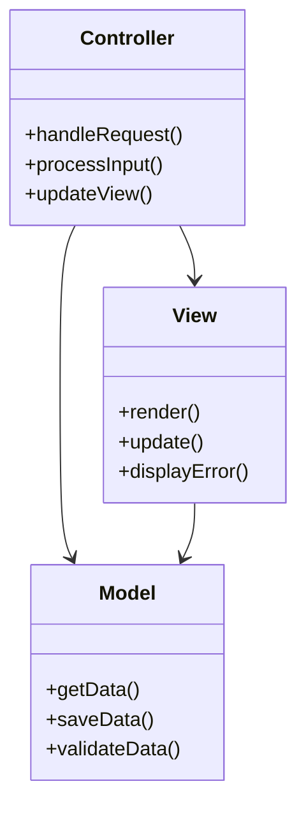

## Gantt Charts (Comparaciones Temporales)

### Patrón: Comparación de Enfoques de Desarrollo
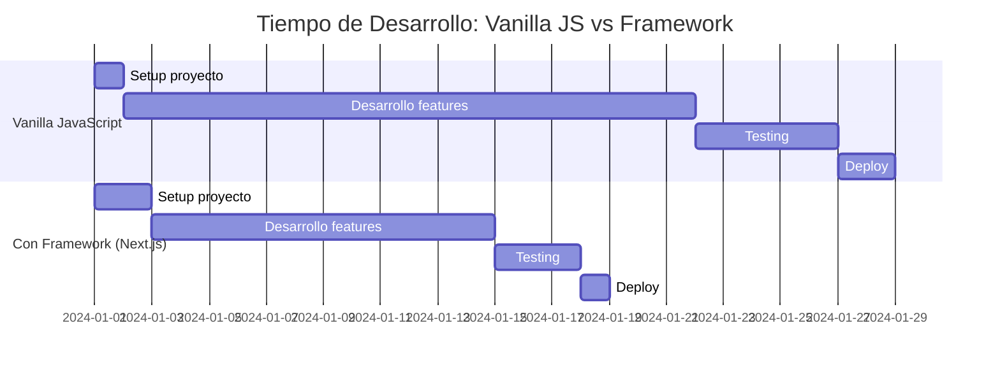

### Patrón: Sprint Planning
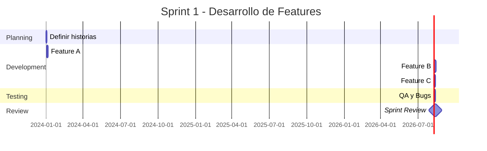

## Diagramas de Flujo de Usuario

### Patrón: User Journey
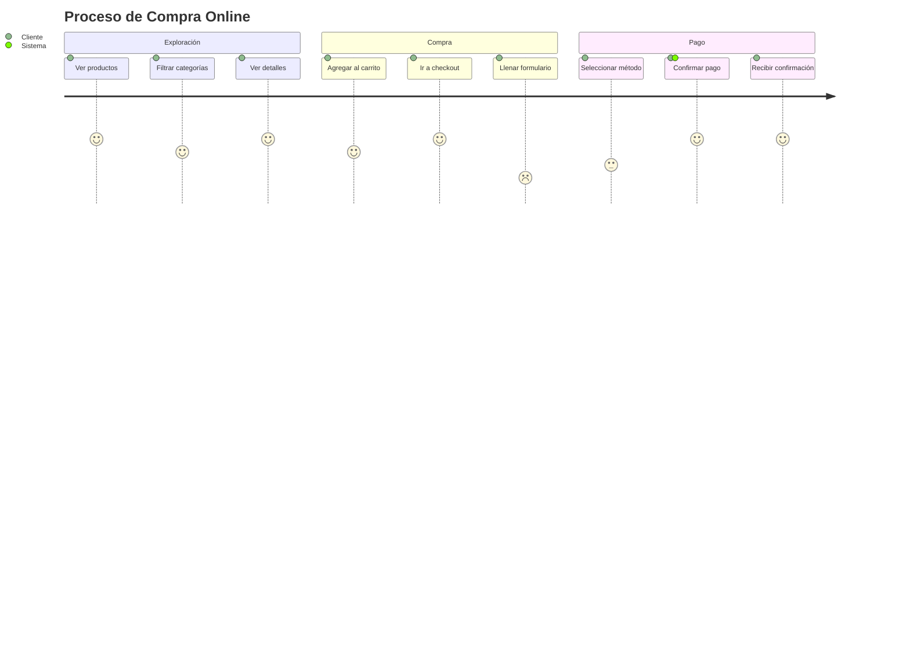

## Git Flow y Branching

### Patrón: Git Workflow
```mermaid
gitgraph
    commit
    branch develop
    checkout develop
    commit
    branch feature-login
    checkout feature-login
    commit
    commit
    checkout develop
    merge feature-login
    branch feature-dashboard
    checkout feature-dashboard
    commit
    checkout develop
    merge feature-dashboard
    checkout main
    merge develop tag: "v1.0"
```

## Diagramas de Paquetes/Módulos

### Patrón: Estructura de Proyecto Next.js
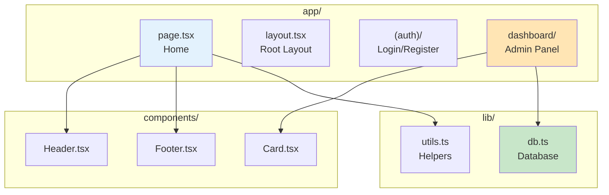

## Consejos de Uso

1. **Mantener diagramas simples:** Máximo 7-10 nodos por diagrama
2. **Usar colores consistentes:** Mismo color para mismo tipo de elemento
3. **Agregar leyendas cuando sea necesario**
4. **Priorizar claridad sobre complejidad**
5. **Usar subgrafos para agrupar elementos relacionados**
6. **Incluir títulos descriptivos**

## Colores Recomendados

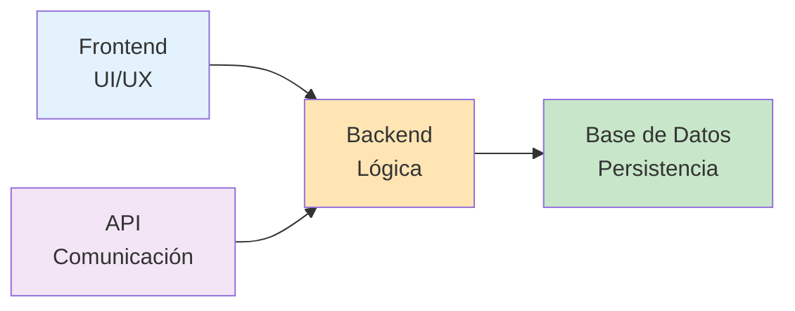

- `#E3F2FD` - Azul claro (Frontend/Cliente)
- `#FFE5B4` - Naranja claro (Backend/Servidor)
- `#C8E6C9` - Verde claro (Base de Datos)
- `#F3E5F5` - Morado claro (APIs/Comunicación)
- `#FFE5E5` - Rojo claro (Errores/Advertencias)
- `#FFF9C4` - Amarillo claro (Decisiones/Condicionales)