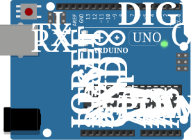

# GeoGreen 🌱

**Medidor IoT de llenado de contenedores de reciclaje** — proyecto de la postulación
al Fondo Concursable VCM 2026, **AIEP Osorno** (Chile).

Un sensor ultrasónico mide cuánto le falta a un contenedor para llenarse y lo
informa con un **semáforo de LEDs** y una **alerta sonora**. La versión completa
proyecta enviar el dato por WiFi a un tablero con la ubicación de cada punto de
reciclaje (de ahí *Geo* + *Green*).

## Estado actual

El **track Arduino** ya está implementado y se puede **simular 100 % por terminal**,
sin placa física ni VS Code, usando PlatformIO + Wokwi CLI.



*Arduino UNO simulado headless desde el CLI (sensor a 20 cm → 89 % de llenado → estado rojo).*

## Qué hace el prototipo

1. El sensor **HC-SR04** mide la distancia entre la tapa y el contenido.
2. El código la convierte en un **porcentaje de llenado** (0–100 %).
3. El semáforo indica el estado:

   | Llenado | LED | Buzzer |
   |---|---|---|
   | `< 40 %` | 🟢 verde | — |
   | `40–79 %` | 🟡 amarillo | — |
   | `≥ 80 %` | 🔴 rojo | 🔊 suena |

## Cómo simularlo (sin VS Code ni Arduino físico)

Requisitos: [PlatformIO Core](https://platformio.org/) y
[Wokwi CLI](https://docs.wokwi.com/wokwi-ci/getting-started) + un token gratuito
de <https://wokwi.com/dashboard/ci> guardado en `~/.wokwi_token`.

```bash
bash arduino/sim.sh         # compila + simula y muestra el Monitor Serie
bash arduino/sim.sh shot    # igual, y genera un screenshot run.png
bash arduino/test.sh        # verifica automáticamente los 3 estados del semáforo
```

Salida esperada de `test.sh`:

```
 80cm -> Llenado: 22 %  (verde)        ... PASS
 50cm -> Llenado: 55 %  (amarillo)     ... PASS
 20cm -> Llenado: 89 %  (rojo+buzzer)  ... PASS
TODOS LOS CASOS PASARON ✓
```

Detalle del circuito, mapa de pines y calibración: [`arduino/README.md`](arduino/README.md).

## Estructura

```
.
├── arduino/                 # Track Arduino UNO (firmware + simulación CLI)
│   ├── src/main.cpp         # Lógica de llenado + semáforo + buzzer
│   ├── diagram.json         # Circuito virtual de Wokwi
│   ├── platformio.ini       # Configuración de compilación
│   ├── sim.sh / test.sh     # Scripts de simulación y test por CLI
│   └── README.md
├── docs/                    # Imágenes del proyecto
├── *.md / *.docx / *.pdf    # Documentación: postulación y listas de componentes
└── componentes-*.png        # Fotos de los componentes
```

## Próximos pasos

- Calibrar `DIST_VACIO` / `DIST_LLENO` al contenedor real.
- Track **ESP32**: pantalla OLED + envío por WiFi a un dashboard.
- Georreferenciar los puntos de reciclaje en un mapa.

---

*Proyecto académico — AIEP Osorno. Carreras de Programación y Análisis de Sistemas,
Electricidad y Electrónica, y Trabajo Social.*
