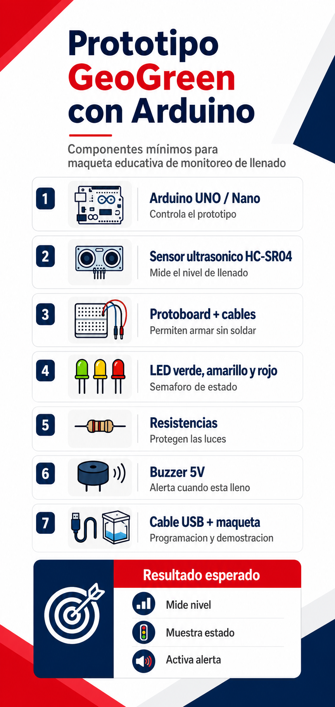
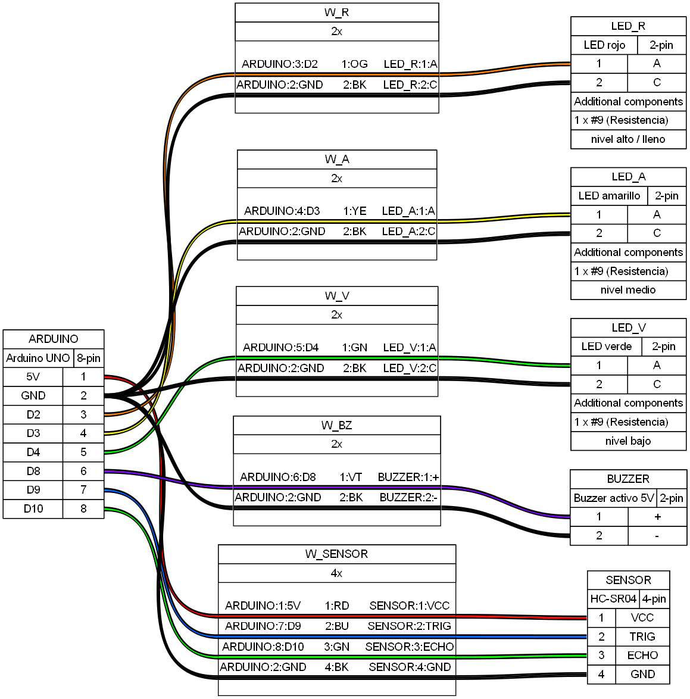
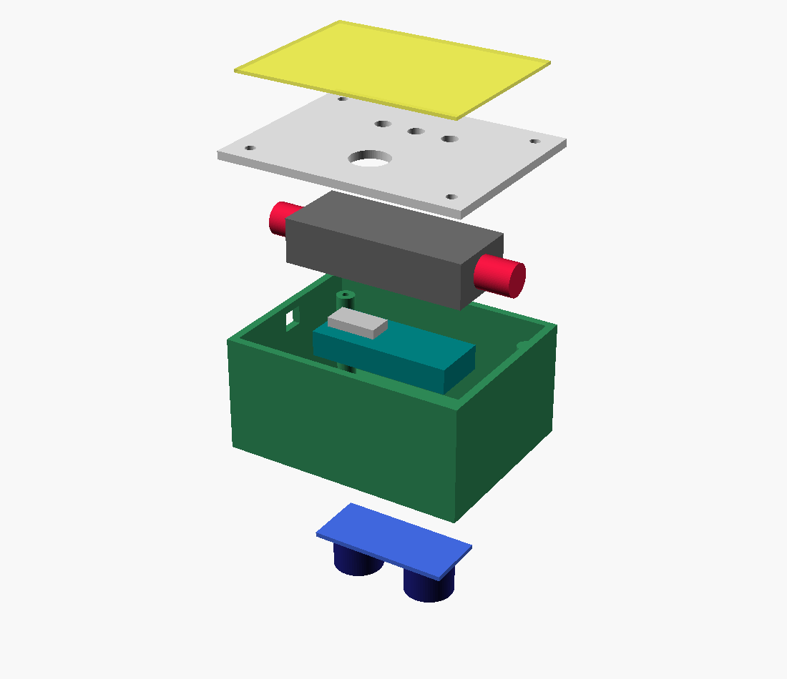
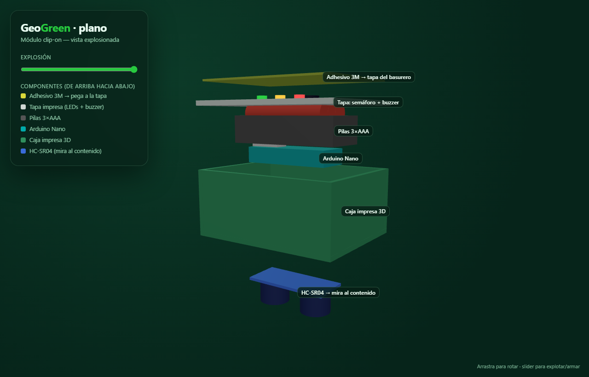
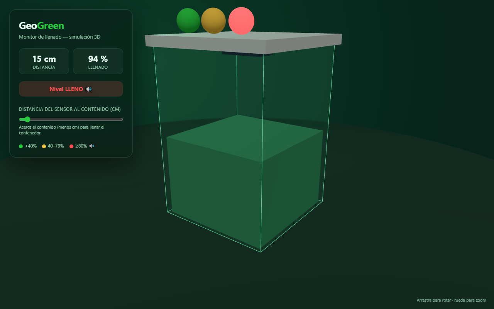

# GeoGreen 🌱

**Medidor IoT de llenado de contenedores de reciclaje** — proyecto de la postulación
al Fondo Concursable VCM 2026, **AIEP Osorno** (Chile).

Un sensor ultrasónico mide cuánto le falta a un contenedor para llenarse y lo
informa con un **semáforo de LEDs** y una **alerta sonora**. La versión completa
proyecta enviar el dato por **WiFi o LoRa** a un tablero con la ubicación
georreferenciada de cada punto de reciclaje (de ahí *Geo* + *Green*).

En esta etapa (continuidad) el proyecto es un **programa educativo — GeoGreen
Escolar**: talleres + demostraciones STEM + un desafío final dictados a un colegio,
usando el dispositivo como caso central. Plan de ejecución y roadmap:
**[`PLAN-GEOGREEN-ESCOLAR.md`](PLAN-GEOGREEN-ESCOLAR.md)**.

<p align="center">
  
</p>

## Estado actual

El **track Arduino** ya está implementado y se puede **simular 100 % por terminal**,
sin placa física ni VS Code, usando PlatformIO + Wokwi CLI.

## Qué hace el prototipo

1. El sensor **HC-SR04** mide la distancia entre la tapa y el contenido.
2. El código la convierte en un **porcentaje de llenado** (0–100 %).
3. El semáforo indica el estado:

   | Llenado | LED | Buzzer |
   |---|---|---|
   | `< 40 %` | 🟢 verde | — |
   | `40–79 %` | 🟡 amarillo | — |
   | `≥ 80 %` | 🔴 rojo | 🔊 suena |

## Cómo simularlo (sin VS Code ni Arduino físico)

Requisitos: [PlatformIO Core](https://platformio.org/) y
[Wokwi CLI](https://docs.wokwi.com/wokwi-ci/getting-started) + un token gratuito
de <https://wokwi.com/dashboard/ci> guardado en `~/.wokwi_token`.

```bash
bash arduino/sim.sh         # compila + simula y muestra el Monitor Serie
bash arduino/sim.sh shot    # igual, y genera un screenshot run.png
bash arduino/test.sh        # verifica automáticamente los 3 estados del semáforo
```

Salida esperada de `test.sh`:

```
 80cm -> Llenado: 22 %  (verde)        ... PASS
 50cm -> Llenado: 55 %  (amarillo)     ... PASS
 20cm -> Llenado: 89 %  (rojo+buzzer)  ... PASS
TODOS LOS CASOS PASARON ✓
```

### Cableado (planos para armar)

Mapa de conexiones generado por CLI con [WireViz](https://github.com/wireviz/WireViz)
(fuente: [`arduino/wiring.yml`](arduino/wiring.yml), regenerar con `wireviz arduino/wiring.yml`):
Arduino Nano + HC-SR04 + semáforo + buzzer, alimentado con 3×AAA y un interruptor.

<p align="center">
  
</p>

¿Prefieres el pictórico clásico (Arduino + protoboard + cablecitos)? Guía paso a
paso para armarlo en Fritzing: [`arduino/GUIA-FRITZING.md`](arduino/GUIA-FRITZING.md).
Mapa de pines y calibración: [`arduino/README.md`](arduino/README.md).

## Módulo clip-on (el diseño físico)

La idea: una **cajita sellada que se pega con adhesivo 3M a la cara interior de
la tapa de cualquier basurero** — sin cableado expuesto, sin perforar, sin
fabricar basureros especiales. El sensor mira hacia abajo al contenido. Adentro
van el Arduino Nano, las pilas 3×AAA, el buzzer y el semáforo.

Plano 3D explosionado (OpenSCAD, [`arduino/3d/modulo.scad`](arduino/3d/modulo.scad)):

<p align="center">
  
</p>

**Plano interactivo** (rotable, con etiquetas y slider de explosión):
[`web/plano.html`](web/plano.html) — `python -m http.server 8099 --directory web`
y abre `http://localhost:8099/plano.html`.

<p align="center">
  
</p>

STL listos para imprimir: [`modulo-base.stl`](arduino/3d/modulo-base.stl) ·
[`modulo-tapa.stl`](arduino/3d/modulo-tapa.stl). Regenerar:

```bash
openscad -o docs/modulo-3d.png --viewall --autocenter arduino/3d/modulo.scad
openscad -D 'vista="tapa"' -o arduino/3d/modulo-tapa.stl arduino/3d/modulo.scad
```

> También está la maqueta demostrativa tipo contenedor completo en
> [`arduino/3d/carcasa.scad`](arduino/3d/carcasa.scad) (`docs/carcasa-3d.png`),
> útil para mostrar el concepto en la presentación.

## Visualización web 3D

Demo interactiva en [`web/index.html`](web/index.html) (Three.js, sin build):
un contenedor 3D que se llena y enciende el semáforo usando **la misma lógica
del firmware**. Arrastra para rotar, mueve el slider de distancia.

<p align="center">
  
</p>

```bash
python -m http.server 8099 --directory web
# abrir http://localhost:8099   (o http://localhost:8099/?dist=15 para verlo lleno)
```

## Estructura

```
.
├── arduino/                 # Track Arduino (firmware + simulación CLI + 3D)
│   ├── src/main.cpp         # Lógica de llenado + semáforo + buzzer
│   ├── diagram.json         # Circuito virtual de Wokwi
│   ├── platformio.ini       # Configuración de compilación
│   ├── sim.sh / test.sh     # Scripts de simulación y test por CLI
│   ├── wiring.yml           # Fuente del diagrama de cableado (WireViz)
│   ├── GUIA-FRITZING.md     # Guía para el pictórico en Fritzing
│   └── 3d/                  # OpenSCAD: modulo.scad (clip-on) + carcasa.scad + STL
├── web/
│   ├── index.html           # Visualización web 3D del llenado (Three.js)
│   └── plano.html           # Plano 3D explosionado interactivo del módulo
├── docs/                    # Imágenes generadas (cableado, renders 3D, web)
├── *.md / *.docx / *.pdf    # Documentación: postulación y listas de componentes
└── componentes-*.png        # Fotos de los componentes
```

## Próximos pasos

- Calibrar `DIST_VACIO` / `DIST_LLENO` al contenedor real.
- Track **ESP32**: pantalla OLED + envío por WiFi a un dashboard.
- Georreferenciar los puntos de reciclaje en un mapa.

---

*Proyecto académico — AIEP Osorno. Carreras de Programación y Análisis de Sistemas,
Electricidad y Electrónica, y Trabajo Social.*
